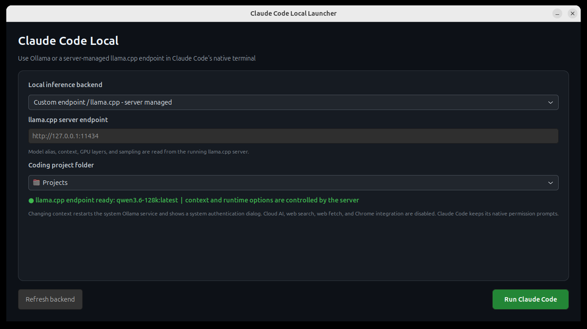

# Claude Code Local Launcher

A small native Linux launcher that opens **Claude Code's official terminal UI** with either **Ollama** or an **Anthropic-compatible llama.cpp endpoint**. Ollama mode manages model and context; custom-endpoint mode leaves model, context, GPU layers, and sampling to the running server.



## Why this exists

`ollama launch claude` is excellent, but changing models, project folders, and Ollama's server-level context window repeatedly is inconvenient. This launcher provides those controls without replacing or embedding Claude Code.

## Features

- Uses Claude Code's native terminal interface.
- Backend selector for Ollama or a custom llama.cpp endpoint.
- Discovers locally installed Ollama models.
- Editable model field for any local Ollama tag.
- Context selector: **4K, 8K, 16K, 32K, 64K, or 128K**.
- Auto-discovers the llama.cpp model alias from `/v1/models`.
- Does not show or alter context/runtime options in custom-endpoint mode.
- Project-folder chooser.
- Restarts Ollama only when the context setting changes.
- Enables Ollama Flash Attention and `q8_0` KV cache for long-context efficiency.
- Disables Claude Code cloud web search, web fetch, and Chrome integration.
- Keeps Claude Code's native file and shell permission prompts.
- Stores only local preferences under the user's XDG config directory.

## Requirements

This release targets Ubuntu/GNOME and closely related Linux desktops.

- Ubuntu 24.04 or a compatible distribution
- GNOME Terminal
- Python 3 with PyGObject/GTK 3 (`python3-gi`, `gir1.2-gtk-3.0`)
- PolicyKit `pkexec` for changing the system Ollama service context
- Official Claude Code CLI (`claude`) for custom-endpoint mode
- [Ollama](https://ollama.com/) with `ollama launch` support for Ollama mode
- A local Ollama model with tool support, or a recent llama.cpp server exposing `/v1/models`, `/v1/messages`, and `/v1/messages/count_tokens`
- An Ollama **system service** named `ollama.service` only when using managed Ollama context

Recommended for coding agents:

- 32 GB system RAM
- NVIDIA GPU with at least 12-16 GB VRAM
- A tool-capable coding model
- 32K or 64K context

## Quick start

### 1. Install Ollama and a local model

Use Ollama's official installation instructions, then pull a model. Example:

```bash
ollama pull qwen3.6:27b
ollama list
```

The launcher never downloads a model silently. The chosen model must already appear in `ollama list`.

### 2. Download and verify the release

```bash
VERSION=1.0.2
BASE=https://github.com/vimal-v-2006/claude-code-ollama-launcher/releases/download/v${VERSION}
curl -LO "$BASE/claude-code-ollama-launcher-${VERSION}.tar.gz"
curl -LO "$BASE/claude-code-ollama-launcher-${VERSION}.tar.gz.sha256"
sha256sum -c "claude-code-ollama-launcher-${VERSION}.tar.gz.sha256"
tar -xzf "claude-code-ollama-launcher-${VERSION}.tar.gz"
cd "claude-code-ollama-launcher-${VERSION}"
```

### 3. Install

```bash
./install.sh
```

A PolicyKit authentication dialog installs one root-owned context helper at:

```text
/usr/local/libexec/claude-code-ollama-launcher/set-context
```

The application itself remains user-installed under `~/.local`.

If you use only a custom llama.cpp endpoint and do not want Ollama context control:

```bash
./install.sh --no-system-helper
```

### 4. Launch

Open the application menu and select **Claude Code Local Launcher**, or run:

```bash
claude-code-ollama-launcher
```

Choose a local model, context window, and coding project. Click **Run Claude Code**.

On first use, `ollama launch claude` may install the official Claude Code CLI. Claude Code then opens in GNOME Terminal with its normal trust and permission flow.

### Custom llama.cpp endpoint mode

Start `llama-server` yourself with all runtime arguments. For example:

```bash
llama-server \
  --model /path/to/model.gguf \
  --alias local-coder \
  --host 127.0.0.1 \
  --port 8080 \
  --ctx-size 32768 \
  --n-gpu-layers 99
```

In the launcher select **Custom endpoint / llama.cpp**, enter `http://127.0.0.1:8080`, choose the project, and run. There are intentionally no context, GPU-layer, or sampling controls in this mode: the launcher discovers the server's model alias and uses the server exactly as configured.

## Controls

| Control | Behavior |
|---|---|
| Local Ollama model | Lists installed model tags and accepts an exact custom local tag |
| Context window | Selects Ollama's server context; changing it restarts `ollama.service` |
| Custom endpoint | Connects Claude Code directly to a server-managed llama.cpp Anthropic-compatible endpoint |
| Coding project folder | Becomes Claude Code's working directory |
| Refresh backend | Reloads Ollama tags or rechecks the custom endpoint |
| Run Claude Code | Applies context if needed and starts Claude Code's native terminal UI |

## Choosing a context window

| Setting | Suggested use | Resource impact |
|---|---|---|
| 4K | Tiny edits and quick questions | Lowest |
| 8K | Small files and focused fixes | Low |
| 16K | Normal coding sessions | Moderate |
| 32K | Larger projects and multi-file work | High |
| 64K | Agentic coding and repository-wide work | Very high |
| 128K | Large repositories on high-memory systems | Extreme |

A model's own maximum context is still the upper bound. Long contexts consume additional RAM/VRAM and may reduce speed. If Ollama fails to load a model, select a smaller context.

## Local-only behavior

The launcher starts Claude Code through:

```bash
ollama launch claude --model <local-tag> --yes -- \
  --no-chrome \
  --disallowedTools WebSearch WebFetch
```

This routes model inference to the local Ollama endpoint and disables Claude Code's built-in web tools and Chrome integration. Claude Code's Bash tool can still run commands you approve, including network-capable commands. Review native permission prompts before accepting them.

## Files installed

User files:

```text
~/.local/bin/claude-code-ollama-launcher
~/.local/share/claude-code-ollama-launcher/
~/.local/share/applications/claude-code-ollama-launcher.desktop
~/.local/share/icons/hicolor/scalable/apps/claude-code-ollama-launcher.svg
~/.config/claude-code-ollama-launcher/settings.json
```

System files:

```text
/usr/local/libexec/claude-code-ollama-launcher/set-context
/etc/systemd/system/ollama.service.d/90-claude-code-ollama-context.conf
```

## Uninstall

From an extracted release or cloned repository:

```bash
./uninstall.sh
```

Remove saved preferences too:

```bash
./uninstall.sh --purge
```

By default, uninstall removes the verified root helper but preserves the active Ollama systemd context configuration so it never deletes service configuration it cannot conclusively own.

Keep both the root context helper and current Ollama context configuration:

```bash
./uninstall.sh --keep-system-helper
```

## Troubleshooting

See [docs/TROUBLESHOOTING.md](docs/TROUBLESHOOTING.md) for detailed diagnosis.

Common checks:

```bash
systemctl status ollama --no-pager
ollama list
ollama ps
claude --version
claude-code-ollama-launcher --self-test
```

## Development

```bash
make lint
make test
make release
```

The project uses Python's standard `unittest`; no PyPI dependencies are required. GTK is only imported when the graphical interface starts, so core tests run headlessly.

## Security

Read [SECURITY.md](SECURITY.md). The runtime context helper is installed root-owned and accepts only an allowlisted numeric context. The GUI never runs a mutable project script through `pkexec`.

## License

MIT License. See [LICENSE](LICENSE).
